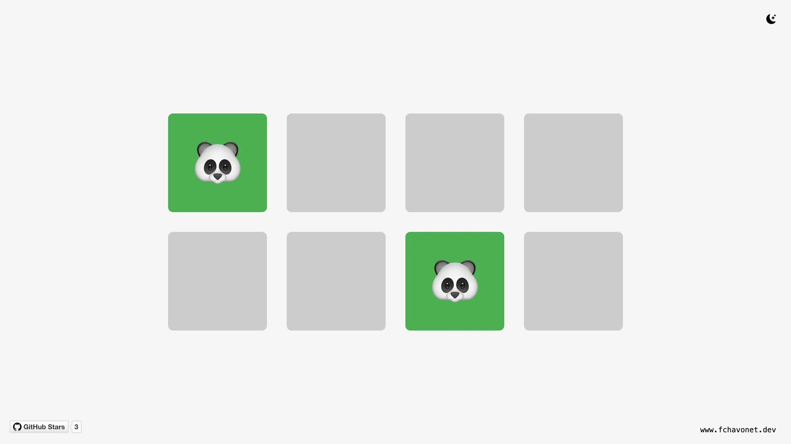

# Simple Memory Game

## 🔖 Table of contents

<details>
        <summary>
        CLICK TO ENLARGE 😇
        </summary>
        📄 <a href="#description">Description</a>
        <br>
        🎓 <a href="#objectives">Objectives</a>
        <br>
        🔨 <a href="#tech-stack">Tech stack</a>
        <br>
        📂 <a href="#files-description">Files description</a>
        <br>
        💻 <a href="#installation_and_how_to_use">Installation and how to use</a>
        <br>
        🔧 <a href="#whats-next">What's next?</a>
        <br>
        ♥️ <a href="#thanks">Thanks</a>
        <br>
        👷 <a href="#authors">Authors</a>
</details>

## 📄 <span id="description">Description</span>

This project was initially developed during a live coding session at Holberton School Toulouse (France), where I work as a Software Engineer and Educational Manager. The goal was to create an interactive and beginner-friendly project to help students understand DOM manipulation, JavaScript event handling, and game logic implementation.

Watch the live coding sessions here:

- [First live coding sessions (FR)](https://www.youtube.com/watch?v=sbYj49XVRIE)
- [Second live coding session (FR)](https://www.youtube.com/watch?v=lt3c-V4D3YA)

Since the live session, I have made several improvements and additions, including:

- Sound effects when a pair is found.
- A better card shuffle algorithm for improved randomness.
- Minor bug fixes and optimizations.

## 🎓 <span id="objectives">Objectives</span>

- Help beginners grasp how the DOM works.
- Demonstrate event handling in JavaScript.
- Show how to dynamically manipulate HTML elements using JavaScript.
- Build an interactive game using only HTML, CSS, and JavaScript.

## 🔨 <span id="tech-stack">Tech stack</span>

<p align="left">
    
    
    
    
    
    
    
</p>

## 📂 <span id="files-description">File description</span>

| **FILE**     | **DESCRIPTION**                                     |
| :----------: | --------------------------------------------------- |
| `assets`     | Contains the resources required for the repository. |
| `index.html` | Main HTML structure for the project.                |
| `style.css`  | Styles and animations for the project.              |
| `script.js`  | Behavior script for interactivity.                  |
| `README.md`  | The README file you are currently reading 😉.       |

## 💻 <span id="installation_and_how_to_use">Installation and how to use</span>

**Installation:**

1. Clone this repository:
    - Open your preferred Terminal.
    - Navigate to the directory where you want to clone the repository.
    - Run the following command:

```
git clone https://github.com/fchavonet/web-simple_memory_game.git
```

2. Open the repository you've just cloned.

**How to use:**

1. Open the `index.html` file in your web browser.
2. Click on a card to reveal its symbol.
3. Try to find its matching pair.
4. If the two selected cards match, they remain flipped.
5. If they don’t match, they flip back after a short delay.
6. Continue until all pairs are found.
7. A sound effect will play when a pair is matched.
8. Once all pairs are found, a message will display the number of attempts.

You can also test the game online by clicking [here](https://fchavonet.github.io/web-simple_memory_game/).

<p align="center">
    
</p>

## 🔧 <span id="whats-next">What's next?</span>

- Improve the game UI (replace alerts with a custom one).
- Save best scores using local storage.
- Make the game mobile-friendly.

## ♥️ <span id="thanks">Thanks</span>

- Thank you to everyone who participated in the live coding sessions!
- A special thanks to Pierre for always giving me feedback on the sound quality and to Yoann for spotting multiple bugs and even finding ways to cheat 😉!

## 👷 <span id="authors">Authors</span>

**Fabien CHAVONET**
- Github: [@fchavonet](https://github.com/fchavonet)
